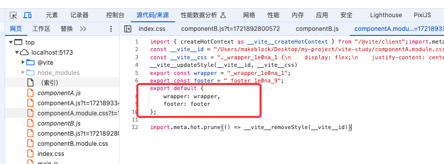

学习自B站的Vite视频
视频笔记地址：https://github.com/passerecho/vite-
Vite 官网：https://cn.vitejs.dev/

## 1. 使用 npm 安装一些依赖
npm init -y 生成 package.json

npm i lodash 安装 lodash

npm i vite -D 安装 vite

## 2. Vite 对 Css 的处理以及对 Css 模块化的简单处理

### Vite 对 Css 的处理
1. 将 index.css 的内容复制到 style 标签，然后将 style 标签插入到 index.html 的 head

2. 将 index.css 中的内容全部替换成 js 脚本(方便热更新或者css模块化)， 同时设置Content-Type为js 从而让浏览器以JS脚本的形式来执行该css后缀的文件
   

### Vite 对 Css 模块化的处理
1. module.css (module是一种约定, 表示需要开启css模块化)
2. 他会将你的所有类名进行一定规则的替换（将footer 替换成 _footer_1e0na_9） 
3. 同时创建一个映射对象{ footer: "_footer_1e0na_9" } 
4. 将替换过后的内容塞进style标签里然后放入到head标签中 (能够读到index.html的文件内容)
5. 将 module.css 中的内容全部替换成了 js，并导出映射对象
   

## 3. Vite 配置文件中 Css 的配置流程(modules 篇)

