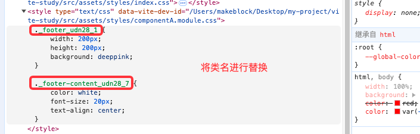

> 学习自B站的Vite视频
1. 视频笔记地址：https://github.com/passerecho/vite-
2. Vite 官网：https://cn.vitejs.dev/


# 项目环境搭建
不使用任何脚手架新建一个 Vite 项目，需要先安装 Node.js，然后使用 npm 安装 Vite。
本项目本地安装的 node 版本为`v20.8.0`，npm 版本为`10.1.0`。

1. 使用 npm 为本项目安装一些依赖
```
npm init -y 生成 package.json

npm i lodash 安装 lodash

npm i vite -D 安装 vite
```

# Vite 对 CSS 的处理
> Vite 支持 CSS、SCSS、LESS、Stylus 等样式文件的处理，同时支持 CSS 模块化。

## Vite 对 CSS 的简单处理
默认情况下，Vite 会对项目中的 CSS 文件进行简单处理。以`index.css`文件为例。具体步骤如下。
```css
/* index.css */
:root {
    --global-color: red;
}

html, body {
    width: 100%;
    background: blue;
    color: var(--global-color);
}
```
1. 将 index.css 的内容复制到 style 标签，然后将 style 标签插入到 index.html 的 head
2. 将 index.css 中的内容全部替换成 js 脚本(方便热更新或者css模块化)， 同时设置Content-Type为js 从而让浏览器以JS脚本的形式来执行该css后缀的文件


## Vite 对 CSS 模块化的处理
大概说一下原理，全部都是基于 node。以`componentA.module.css`文件为例。具体步骤如下。
```css
/* componentA.module.css */
.footer {
    width: 200px;
    height: 200px;
    background: deeppink;
}

.footer-content {
    color: white;
    font-size: 20px;
    text-align: center;
}
```

1. `*.module.css` (module是一种约定, 表示需要开启css模块化)
2. 他会将你的所有类名进行一定规则的替换
3. 同时创建一个映射对象
4. 将替换过后的内容塞进style标签里然后放入到head标签中 (能够读到index.html的文件内容)
5. 将 module.css 中的内容全部替换成了 js，并导出映射对象



# Vite 中 CSS 的模块化配置 
> 在`vite.config.js`中我们通过`css`属性去控制整个vite对于css的处理行为

以`vite.base.config.js`文件为例。观察不同配置对`componentA.module.css`文件的影响。


## localConvention
修改生成的映射对象 key 的命名形式(驼峰命名还是中划线命名)，**不配置默认是中划线命名**。

```js
// vite.base.config.js
export default defineConfig({
  css: {  // 对 css 的行为进行配置
    modules: {  // 是对 css 模块化的默认行为进行覆盖
      localsConvention: "camelCaseOnly", // 取值有 'camelCase' | 'camelCaseOnly' | 'dashes' | 'dashesOnly'
    },
  },
});
```

1. 当取值为`camelCaseOnly`时，生成的映射对象 key 为驼峰命名。
```js
// componentA.module.css
export default {
  footer: footer,
  footerContent: footerContent
};
```
2. 当取值为`dashes`时，生成的映射对象 key 同时有驼峰和中横线。
```js
// componentA.module.css
export default {
    footer: footer,
    "footer-content": "_footer-content_udn28_7",
    footerContent: footerContent
};
```

## scopeBehaviour
配置当前的模块化行为是模块化还是全局化 (有hash就是开启了模块化的一个标志, 因为他可以保证产生不同的hash值来控制我们的样式类名不被覆盖)
，**默认值是`local`**。

## generateScopedName
生成的类名的规则(可以配置为函数, 也可以配置成字符串规则: https://github.com/webpack/loader-utils#interpolatename)

## hashPrefix
生成hash会根据你的类名 + 一些其他的字符串(文件名 + 他内部随机生成一个字符串)去进行生成, 如果你想要你生成hash更加的独特一点, 你可以配置hashPrefix, 你配置的这个字符串会参与到最终的hash生成, （hash: 只要你的字符串有一个字不一样, 那么生成的hash就完全不一样, 但是只要你的字符串完全一样, 生成的hash就会一样）

## globalModulePaths
代表你不想参与到css模块化的路径

# Vite 中 CSS 的预处理器配置
> 在`vite.config.js`中通过`preprocessorOptions`属性去控制vite对css预处理的行为

主要是用来配置css预处理的一些全局参数，假设没有使用构建工具, 我们又想去编译 less 文件的话。

```
yarn add less # lessc的编译器
```
你只要安装了node, 你就可以使用node index.js 你只要安装了less 你就可以使用lessc去编译less文件

less是可以定义变量的


# Vite 中 POSTCSS 的配置
## postcss 的前世今生
1. 安装依赖

```
npm i -D postcss-cli postcss
```

2. 直接在css.postcss中进行配置, 该属性直接配置的就是postcss的配置


# Vite 中静态资源别名的配置
